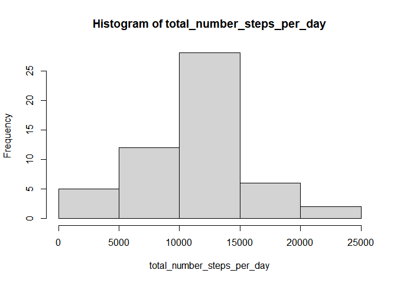
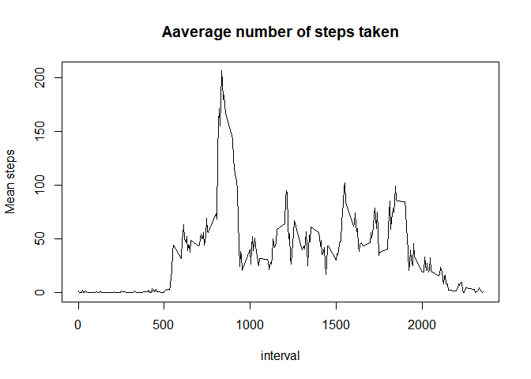
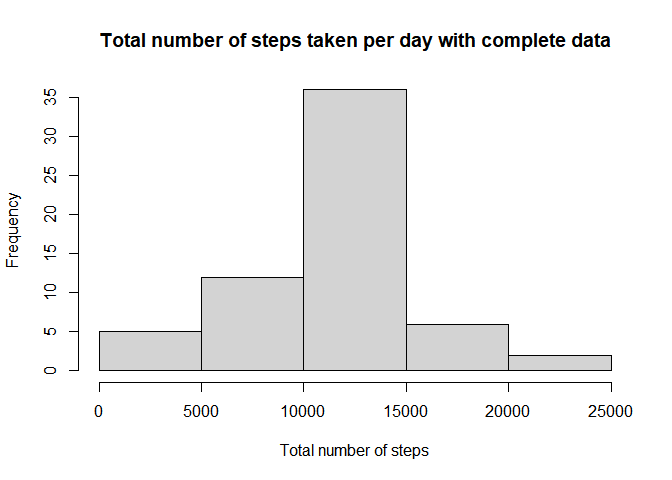
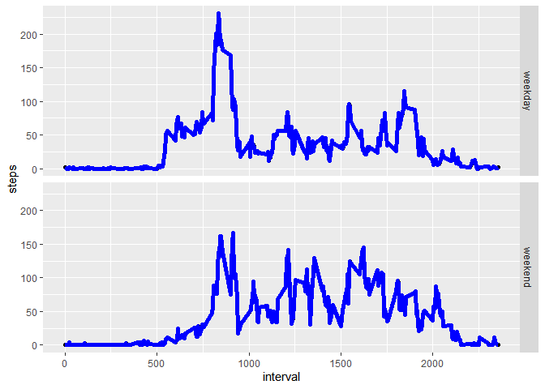

---
title: "USA weather damages"
author: "Mathias"
date: "05/10/2020"
always_allow_html: yes
---

## Loading and preprocessing the data

### Get the data

```r
url = "https://d396qusza40orc.cloudfront.net/repdata%2Fdata%2Factivity.zip"
destfile = "activity.zip"

if (!file.exists("activity.zip")){
  download.file(url, destfile = destfile)
}

unzip(destfile)

data = read.csv("activity.csv")
```

### Preprocessing


```r
str(data)
```

```
## 'data.frame':	17568 obs. of  3 variables:
##  $ steps   : int  NA NA NA NA NA NA NA NA NA NA ...
##  $ date    : chr  "2012-10-01" "2012-10-01" "2012-10-01" "2012-10-01" ...
##  $ interval: int  0 5 10 15 20 25 30 35 40 45 ...
```
Th dataset has 3 variables

#### The steps

```r
sum(is.na(data$steps))
```

```
## [1] 2304
```
There is 2304 missing values. We will delete them and create a new df

```r
dat <- data[!is.na(data$steps),]
dat_na <- data[is.na(data$steps),]
```

#### The dates

```r
length(dat_na$steps)
```

```
## [1] 2304
```

```r
dat$date <- as.factor(dat$date)
```

53 days recorded in the dataset

#### The intervals

```r
sum(is.na(dat$interval))
```

```
## [1] 0
```


## What is mean total number of steps taken per day?

### Total Number steps per day

```r
total_number_steps_per_day <- with(dat,
                           tapply(dat$steps,
                                  as.factor(dat$date),
                                  sum))

head(total_number_steps_per_day)
```

```
## 2012-10-02 2012-10-03 2012-10-04 2012-10-05 2012-10-06 2012-10-07 
##        126      11352      12116      13294      15420      11015
```

### Total Number steps per day histogram

```r
hist(total_number_steps_per_day)
```

<!-- -->
### Mean and Median of Total steps per day

```r
mean(total_number_steps_per_day)
```

```
## [1] 10766.19
```

```r
median(total_number_steps_per_day)
```

```
## [1] 10765
```

## What is the average daily activity pattern?

### Time serie plot

```r
mean_steps <- with(dat, tapply(steps,
                               dat$interval,
                               mean))

interval <- levels(as.factor(dat$interval))
plot(interval, mean_steps, type = "l",
     main = "Aaverage number of steps taken",
     xlab = "interval",
     ylab = "Mean steps")
```

<!-- -->

### Max total steps in 5 minute interval

```r
tab <- data.frame(mean_steps, interval)
tab[tab$mean_steps== max(tab$mean_steps),][2]
```

```
##     interval
## 835      835
```

## Imputing missing values

### Missing values

```r
sum(is.na(data$steps))
```

```
## [1] 2304
```

### Impute the NAs
The simplest solution is to impute the global mean

```r
mean_steps <- with(dat, tapply(steps, dat$interval, mean))
dat_na$steps <- mean_steps
```

```r
dat_complete <- rbind(dat, dat_na)
dat_complete <- dat_complete[order(dat_complete$date), ]
head(dat_complete)
```

```
##     steps       date interval
## 289     0 2012-10-02        0
## 290     0 2012-10-02        5
## 291     0 2012-10-02       10
## 292     0 2012-10-02       15
## 293     0 2012-10-02       20
## 294     0 2012-10-02       25
```


```r
total_number_steps_complete <- with(dat_complete, tapply(steps, as.factor(dat_complete$date), sum))
#Make a histogram of the total number of steps taken each day
hist(total_number_steps_complete,
     main = "Total number of steps taken per day with complete data",
     xlab = "Total number of steps")
```

<!-- -->

### Mean and Median

```r
mean(total_number_steps_complete)
```

```
## [1] 10766.19
```

```r
median(total_number_steps_complete)
```

```
## [1] 10766.19
```

## Are there differences in activity patterns between weekdays and weekends?

### create the weekday feature

```r
dat_complete$days <- weekdays(as.Date(dat_complete$date))
i <-  1
for (day in dat_complete$days){
  if (day == "dimanche" | day == "samedi"){
    dat_complete$day_type[i] <- "weekend"
    }
  else {
    dat_complete$day_type[i] <- "weekday"
  }
  i = i + 1
}
dat_complete$day_type <-  as.factor(dat_complete$day_type)
```

### Plots


```r
library (ggplot2)

mean_number_steps_day_type <- aggregate(steps~ interval+day_type, dat_complete, mean)
head(total_number_steps_per_day)
```

```
## 2012-10-02 2012-10-03 2012-10-04 2012-10-05 2012-10-06 2012-10-07 
##        126      11352      12116      13294      15420      11015
```

```r
g <- qplot(interval,
           steps,
           data = mean_number_steps_day_type,
           facets = day_type~.) + geom_line(size = 2, color="blue")
g
```

<!-- -->

